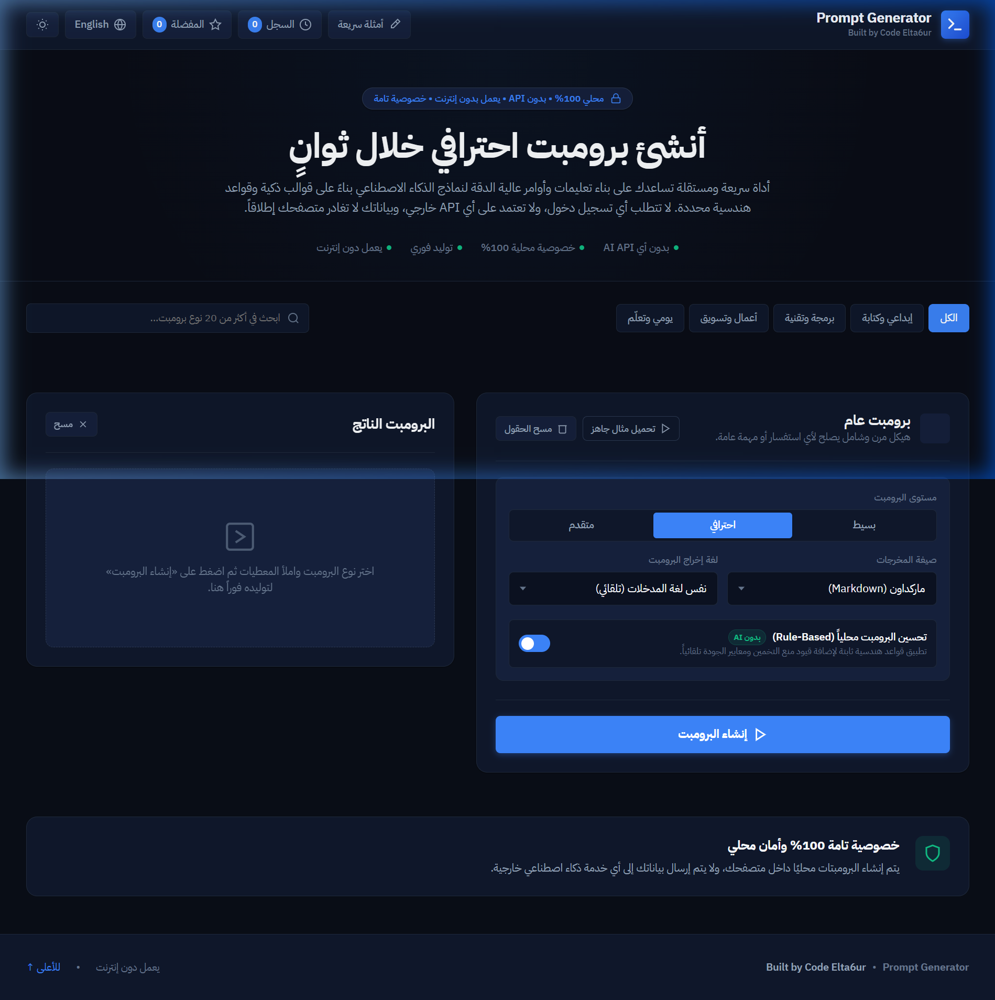
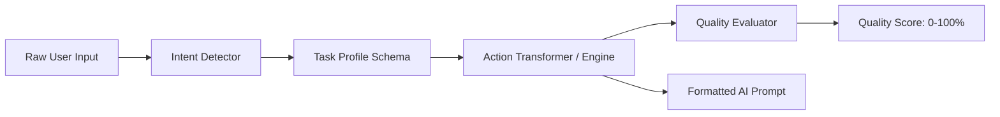
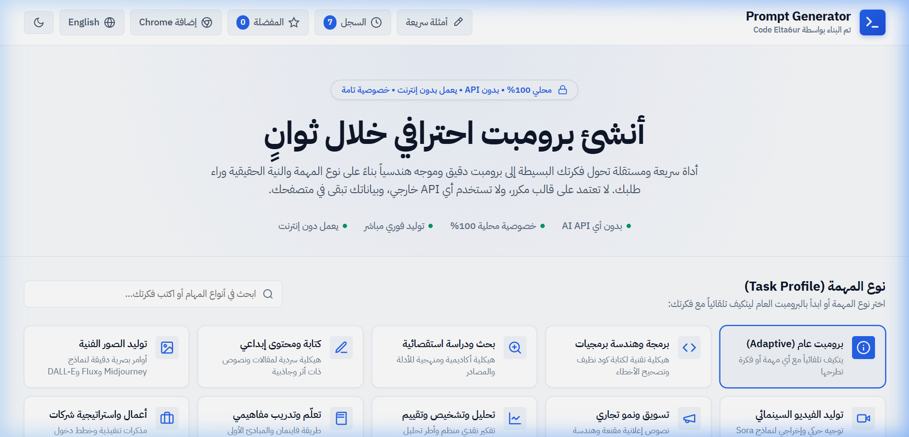

# Prompt Generator

<div align="center">



**A lightweight, privacy-first prompt generator and enhancer that helps users create, improve, rewrite, and structure prompts locally in the browser — without AI APIs, backend services, accounts, or external processing.**

*محرك هندسة برومبتات ذكي ومستقل يعمل محلياً 100% داخل المتصفح، مع إضافة متصفح Chrome متكاملة لإعادة صياغة وتحسين الأوامر في أي موقع بدون خوادم خارجية وبدون أي AI API.*

[](LICENSE)
[](extension/manifest.json)
[](service-worker.js)
[-blueviolet.svg)](#privacy-guarantee)
[](tests/engine.test.js)
[](https://github.com/mokashreef)
[](https://github.com/mokashreef)

[🌐 Live Demo](https://mokashreef.github.io/prompt-generator/) • [🧩 Chrome Extension](#chrome-extension) • [📖 العربية](#نظرة-عامة-باللغة-العربية) • [💻 Local Setup](#installation--local-development)

</div>

---

## 📋 Table of Contents / جدول المحتويات

- [Project Overview](#project-overview)
- [نظرة عامة باللغة العربية](#نظرة-عامة-باللغة-العربية)
- [Key Features](#key-features)
- [Why Prompt Generator?](#why-prompt-generator)
- [How It Works](#how-it-works)
- [Core Prompt Engine](#core-prompt-engine)
- [Supported Task Profiles](#supported-task-profiles)
- [Chrome Extension (Manifest V3)](#chrome-extension)
- [Privacy Guarantee](#privacy-guarantee)
- [Screenshots](#screenshots)
- [Tech Stack](#tech-stack)
- [Project Structure](#project-structure)
- [Installation & Local Development](#installation--local-development)
- [Chrome Extension Installation](#chrome-extension-installation)
- [GitHub Pages Deployment](#github-pages-deployment)
- [Roadmap](#roadmap)
- [Contributing](#contributing)
- [License](#license)
- [Credits & Attribution](#credits--attribution)

---

## 🌟 Project Overview

**Prompt Generator** is a production-grade, 100% client-side web application and companion **Chrome Extension (Manifest V3)** that structures, improves, rewrites, and scores AI prompts based on concrete prompt engineering principles and intent heuristics.

Most generic prompt tools either rely on paid external cloud APIs (such as OpenAI, Anthropic, or Gemini) or duplicate identical template wrappers across every task. Prompt Generator takes a radically different engineering approach:

1. **Zero External AI APIs:** All transformations, heuristics, and quality checks run deterministically on the client device inside the browser's JavaScript engine.
2. **True Architectural Diversity:** Every task profile generates a fundamentally tailored structure (e.g. step-by-step verification for code debugging, scene narrative and parameters for image generation, trade-off matrices for technology comparisons).
3. **No Hallucinated Context:** If a user provides minimal input (e.g. `"build a website"`), the engine introduces clear operational placeholders (such as `[Target Audience]` or `[Preferred Technology]`) rather than fabricating fictional facts.
4. **Browser-Wide Extension:** Seamlessly enhance and replace prompts in-page across ChatGPT, Claude, Gemini, Notion, or any textarea/input with zero page reloads.

---

## 🌍 نظرة عامة باللغة العربية

**Prompt Generator** هي أداة ويب احترافية ومستقلة، يرافقها **إضافة متصفح Chrome (Manifest V3)**، تهدف إلى مساعدة المطورين وصناع المحتوى والباحثين على تحسين، إعادة صياغة، وهندسة البرومبتات لتكون موجهة وعالية الجودة دون الاعتماد على أي واجهات برمجية خارجية (APIs).

### المبادئ الصارمة للمشروع:
* **معالجة محلية بالكامل (100% Client-Side):** لا تتصل الأداة بأي خوادم خارجية أو خدمات مثل OpenAI أو Claude أو Gemini. بياناتك لا تغادر جهازك إطلاقاً.
* **بدون تسجيل دخول أو مفاتيح اشتراك:** جاهزة للاستخدام الفوري بدون حسابات وبدون قيود.
* **محرك هندسي موحد:** تشترك إضافة المتصفح مع الموقع الإلكتروني في نفس المحرك البرمجي وقواعد التشخيص وهياكل المهام.
* **لا اختلاق للسياق:** الأداة لا تفترض معلومات غير موجودة؛ بل تضع محددات وPlaceholders واضحة مثل `[الجمهور المستهدف]` أو `[الميزانية]` ليركز المستخدم عليها.

---

## ⚡ Key Features

- **🎯 Intent Detection Engine:** Automatically identifies user intent (Create, Analyze, Teach, Compare, Rewrite, Research) and calibrates output parameters.
- **🧱 10 Bespoke Task Profiles:** From general tasks to full-stack code debugging, competitive business strategy, Midjourney visual prompts, and data analysis.
- **📊 Objective Quality Scoring (0–100%):** Evaluates prompts against objective criteria: goal specificity, situational context, deliverables, guardrails, and structure.
- **🧩 Manifest V3 Chrome Extension:**
  - **Context Menu:** Right-click selected text in any page $\rightarrow$ `Improve Prompt / تحسين البرومبت`.
  - **Side Panel & Popup:** Side-by-side prompt editor for comfortable long-form editing.
  - **In-Page Text Replacement:** Safely replaces text in `textarea`, `input`, and reactive `contenteditable` editors (ChatGPT/Claude/Gemini) without DOM corruption.
  - **Visual Diff Viewer:** Highlights added, deleted, and modified lines and words in real time.
  - **11 Independent Actions:** `Improve`, `Rewrite`, `Make Specific`, `Make Detailed`, `Make Concise`, `Fix Structure`, `Add Constraints`, `Output Format`, `Professional`, `Simplify`, and `Translate`.
- **🌙 Sleek Developer UI:** Minimalist developer tool aesthetic with Dark Mode, Light Mode, and complete Arabic (RTL) & English (LTR) localization.
- **💾 100% Local Storage:** Bookmark favorite prompts and browse generation history via browser storage (`localStorage` & `chrome.storage.local`).
- **📦 Direct ZIP Download:** Download the unpacked extension package directly from the web interface.

---

## 💡 Why Prompt Generator?

| Feature | Standard "AI Wrappers" | Prompt Generator |
| :--- | :--- | :--- |
| **API Costs & Keys** | Requires paid OpenAI / Claude API keys | **Zero Cost • No API Keys** |
| **Data Privacy** | Sends your prompts to third-party cloud servers | **100% Private (Never leaves your device)** |
| **Offline Operation** | Fails completely without active internet | **Fully functional offline (PWA & Local Engine)** |
| **Extension Support** | Bulky SaaS plugins with heavy tracking | **Lightweight Manifest V3 Chrome Extension** |
| **Hallucination** | Often fabricates fictional assumptions | **Maintains truth with explicit placeholders** |
| **Speed** | 2–5 seconds cloud latency | **Instantaneous (< 10ms local V8 processing)** |

---

## ⚙️ How It Works



1. **Input Analysis:** The system cleans the input and identifies primary keywords and language direction.
2. **Intent Classification:** Classifies the intent into one of six core categories: `create`, `analyze`, `teach`, `compare`, `rewrite`, or `research`.
3. **Profile Adaptation:** Injects domain-specific guardrails, instructions, and standard placeholders.
4. **Action Transformation:** Applies the selected action logic (e.g., adding negative constraints, structuring markdown headers, condensing instructions).
5. **Quality Scoring:** Analyzes structural metrics (goal definition, context availability, format criteria, boundaries) to calculate an objective score.

---

## 🧠 Core Prompt Engine

The engine is located in [`js/engine/`](file:///d:/my%20projects/Prompt%20Generator/js/engine/) and mirrored in [`extension/shared/engine/`](file:///d:/my%20projects/Prompt%20Generator/extension/shared/engine/):

- [`promptEngine.js`](file:///d:/my%20projects/Prompt%20Generator/js/engine/promptEngine.js): Core builder supporting structured profile forms and adaptive general prompts.
- [`actionTransformer.js`](file:///d:/my%20projects/Prompt%20Generator/js/engine/actionTransformer.js): Coordinates the 11 specialized transformation actions.
- [`intentDetector.js`](file:///d:/my%20projects/Prompt%20Generator/js/engine/intentDetector.js): Deterministic regex heuristics for intent diagnosis.
- [`qualityEvaluator.js`](file:///d:/my%20projects/Prompt%20Generator/js/engine/qualityEvaluator.js): Multi-point quality evaluation criteria.
- [`taskProfiles.js`](file:///d:/my%20projects/Prompt%20Generator/js/data/taskProfiles.js): Definitions of 10 bespoke task categories and fields.

---

## 🎯 Supported Task Profiles

1. **General Prompt (البرومبت العام):** Adaptable baseline for any open-ended objective.
2. **Code & Development (برمجة وتطوير):** Focuses on code state, error logs, runtime environment, and minimal diffs.
3. **Writing & Content (كتابة ومحتوى):** Tailored for tone of voice, readership, format, and structure.
4. **Research & Analysis (بحث وتحليل):** Demands sources, analytical methodology, and counter-perspectives.
5. **Business Strategy (استراتيجية وأعمال):** Incorporates SWOT frameworks, KPIs, and market viability.
6. **AI Image Generation (توليد الصور):** Calibrated for Midjourney, FLUX, and DALL-E (lighting, aspect ratio, camera shot).
7. **Marketing & Copywriting (تسويق وإعلانات):** Focuses on value proposition, target persona, and Call to Action.
8. **Education & Learning (تعليم وشرح):** Emphasizes progressive pedagogical steps and practical exercises.
9. **Data & Analytics (بيانات وتحليل):** Structures data schemas, cleaning steps, and visualization tools.
10. **Video & Audio (فيديو وسيناريو):** Structures timestamps, visual b-roll, audio cues, and voiceover pacing.

---

## 🧩 Chrome Extension

The Chrome Extension allows prompt engineering without leaving your active tab.



### Capabilities:
- **Context Menu:** Highlight text on ChatGPT, Claude, or any website, right-click, and select **"Improve Prompt / تحسين البرومبت"**.
- **Chrome Side Panel:** Opens Chrome's native side panel with an **Original vs Improved** comparison editor.
- **In-Page Replace:** Safely replaces your highlighted prompt with the improved version directly inside modern web rich-text editors.
- **Diff View:** Toggle **"Show Changes"** to see an inline visual diff of all modifications.
- **Keyboard Shortcut:** Press <kbd>Ctrl</kbd> + <kbd>Shift</kbd> + <kbd>P</kbd> (or <kbd>Cmd</kbd> + <kbd>Shift</kbd> + <kbd>P</kbd> on macOS).

---

## 🔒 Privacy Guarantee

* **Zero Network Requests:** Your prompts are never transmitted across the network.
* **No Account Required:** No authentication, cookies, or user tracking.
* **No AI Cloud API Keys:** No OpenAI, Anthropic, or Google API keys required or accepted.
* **Manifest V3 Compliant:** Full adherence to Chrome Web Store security and Content Security Policy (CSP) standards.

---

## 📸 Screenshots

| Homepage (Dark Mode - Arabic) | English LTR Interface |
| :---: | :---: |
|  |  |

| Extension Modal & ZIP Download | Light Theme Mode |
| :---: | :---: |
|  |  |

---

## 💻 Tech Stack

- **Frontend Core:** Vanilla HTML5, Vanilla JavaScript (ES Modules), Vanilla CSS.
- **Styling:** Custom CSS design system with CSS custom properties (`--bg-surface`, `--accent-primary`), responsive fluid layout, and CSS Grid/Flexbox.
- **PWA & Offline:** Service Worker API with Cache-First asset caching.
- **Extension:** Chrome Extensions Manifest V3 (`service_worker`, `side_panel`, `content_scripts`, `contextMenus`, `commands`, `storage`).
- **Testing:** Node.js native test runner (`node tests/engine.test.js`).

---

## 📁 Project Structure

```text
prompt-generator/
├── .github/
│   ├── ISSUE_TEMPLATE/
│   │   ├── bug_report.md
│   │   └── feature_request.md
│   ├── workflows/
│   │   └── ci.yml
│   └── PULL_REQUEST_TEMPLATE.md
├── assets/
│   └── icons/
│       ├── favicon.svg
│       ├── icon-192.png
│       └── icon-512.png
├── css/
│   ├── main.css
│   ├── responsive.css
│   └── themes.css
├── docs/
│   └── images/
│       ├── homepage.png
│       ├── extension-modal.png
│       ├── english-ltr.png
│       └── light-mode.png
├── extension/
│   ├── assets/
│   │   └── icons/
│   ├── background/
│   │   └── service-worker.js
│   ├── content/
│   │   └── content.js
│   ├── popup/
│   │   ├── popup.html
│   │   ├── popup.css
│   │   └── popup.js
│   ├── shared/
│   │   ├── diff.js
│   │   ├── i18n.js
│   │   └── engine/
│   │       ├── actionTransformer.js
│   │       ├── intentDetector.js
│   │       ├── promptEngine.js
│   │       ├── qualityEvaluator.js
│   │       └── taskProfiles.js
│   ├── sidepanel/
│   │   ├── sidepanel.html
│   │   ├── sidepanel.css
│   │   └── sidepanel.js
│   ├── manifest.json
│   ├── PRIVACY.md
│   └── README.md
├── js/
│   ├── data/
│   │   ├── examples.js
│   │   ├── taskProfiles.js
│   │   └── translations.js
│   ├── engine/
│   │   ├── actionTransformer.js
│   │   ├── intentDetector.js
│   │   ├── promptEngine.js
│   │   ├── qualityEvaluator.js
│   │   └── storage.js
│   ├── ui/
│   │   ├── formRenderer.js
│   │   ├── modals.js
│   │   └── toast.js
│   └── app.js
├── tests/
│   └── engine.test.js
├── .gitignore
├── CHANGELOG.md
├── CODE_OF_CONDUCT.md
├── CONTRIBUTING.md
├── index.html
├── manifest.json
├── package.json
├── prompt-generator-extension.zip
├── robots.txt
├── SECURITY.md
├── service-worker.js
└── sitemap.xml
```

---

## 🚀 Installation & Local Development

### Prerequisites
- Node.js (version 18 or newer recommended for running tests).
- Any standard web browser (Chrome 116+ recommended for full Side Panel extension support).

### 1. Clone the Repository
```bash
git clone https://github.com/mokashreef/prompt-generator.git
cd prompt-generator
```

### 2. Run Automated Tests
```bash
npm test
```

### 3. Start a Local Web Server
Since the project uses modern ES Modules, it requires an HTTP server rather than opening `file:///` directly:

```bash
# Option A: Using NPM script
npm run dev

# Option B: Using Python built-in server
python -m http.server 8080

# Option C: Using npx serve
npx serve -l 8080 .
```

Navigate to `http://localhost:8080/index.html` in your browser.

---

## 🧩 Chrome Extension Installation

You can load the extension directly into Google Chrome in seconds:

1. Open **Google Chrome** and navigate to:
   ```text
   chrome://extensions
   ```
2. Enable **Developer mode** (toggle switch in the top-right corner).
3. Click the **Load unpacked** button in the top-left toolbar.
4. Select the `extension` folder located inside the repository:
   ```text
   /path/to/prompt-generator/extension
   ```
5. The extension is now installed! Pin it to your Chrome toolbar for rapid access.

*(Alternatively, you can download `prompt-generator-extension.zip` directly from the website UI, extract it, and select the extracted folder).*

---

## 🌐 GitHub Pages Deployment

The web application is pure static HTML/CSS/JS with zero build steps or bundlers required, making GitHub Pages deployment seamless:

1. Push your repository to GitHub (`main` branch).
2. Go to repository **Settings** $\rightarrow$ **Pages**.
3. Under **Build and deployment**:
   - **Source:** Deploy from a branch
   - **Branch:** `main`
   - **Folder:** `/ (root)`
4. Click **Save**. Your site will be live at `https://<username>.github.io/<repository-name>/`.

---

## 🗺️ Roadmap

- [x] Intent diagnosis engine with 6 classification states.
- [x] 10 specialized task profiles.
- [x] Objective Quality Score calculator (0–100%).
- [x] Manifest V3 Chrome Extension with Side Panel and Popup.
- [x] Universal safe in-page replacement across rich-text editors.
- [x] 11 transformation actions and visual diff viewer.
- [x] Direct ZIP package download from website.
- [ ] Customizable user-defined prompt profile templates.
- [ ] Export prompt templates as reusable JSON recipes.

---

## 🤝 Contributing

Contributions are welcome! Please review [`CONTRIBUTING.md`](./CONTRIBUTING.md) and [`CODE_OF_CONDUCT.md`](./CODE_OF_CONDUCT.md) before opening a pull request.

---

## 📄 License

This project is licensed under the **MIT License**.  
See the [`LICENSE`](./LICENSE) file for more information.

---

## 👨‍💻 Credits & Attribution

* **Project:** Prompt Generator
* **Designed & Developed by:** **[Mohammad Abu Khashreef](https://github.com/mokashreef)** (محمد أبو خشريف)
* **Organization / Ecosystem:** Part of the **Code Elta6ur** (منظومة كود التطور) ecosystem.

> *Designed and developed by Mohammad Abu Khashreef as part of the Code Elta6ur ecosystem.*  
> *تمت برمجة وتصميم المشروع بواسطة محمد أبو خشريف، وهو جزء من منظومة كود التطور.*
